# buaa_daily_check

适用于ios的自动每日健康上报脚本，不需要定位。

## 使用方法

1. 先在ios上下载Scriptable软件

2. buaaCheck.js添加到Scriptable内

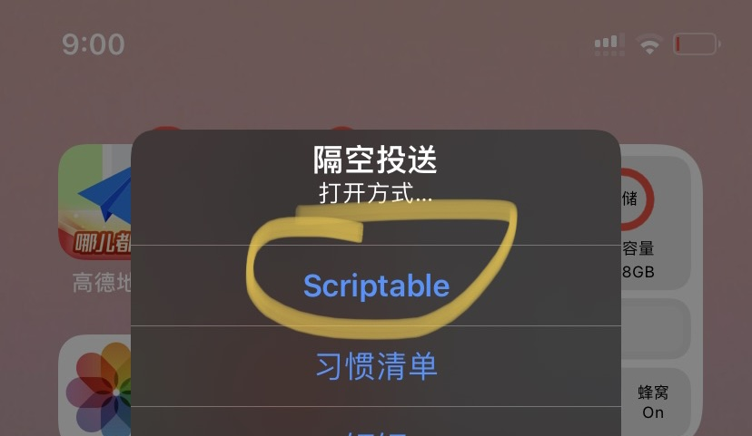

3. 修改buaaCheck.js的username和password为自己统一身份认证的用户名和密码

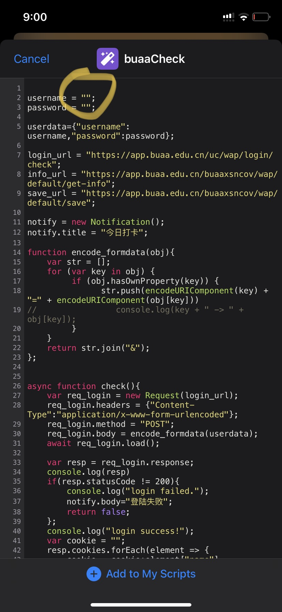

4. 运行脚本查看是否有错误

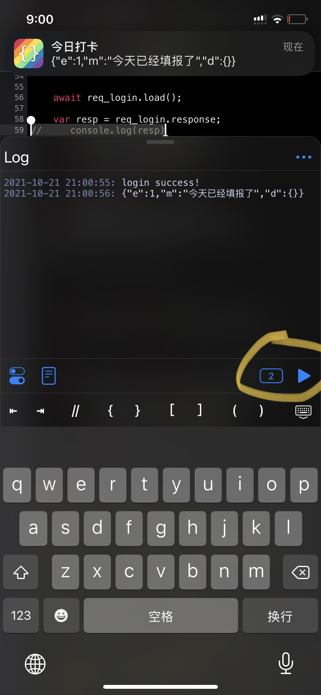

5. 在快捷指令app里面添加一个每天下午5:30的自动化
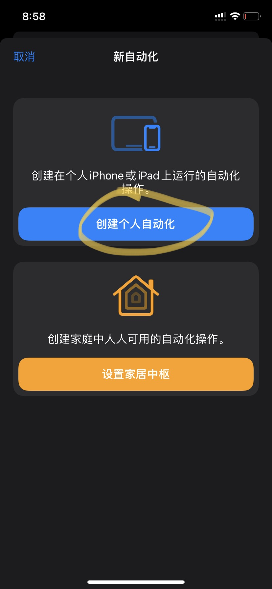
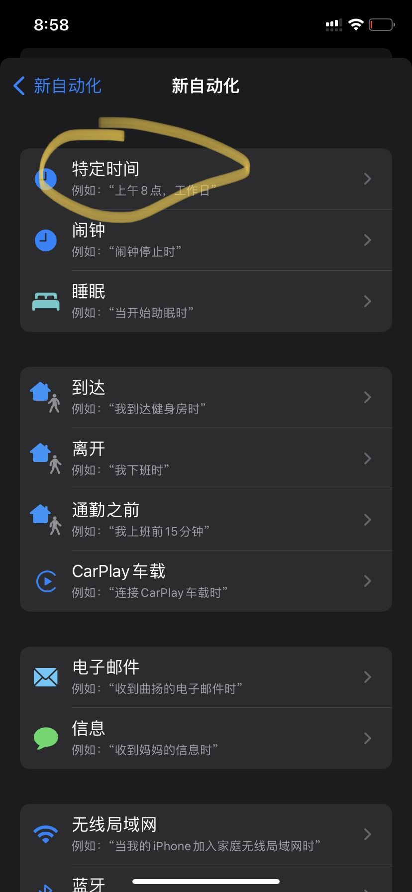
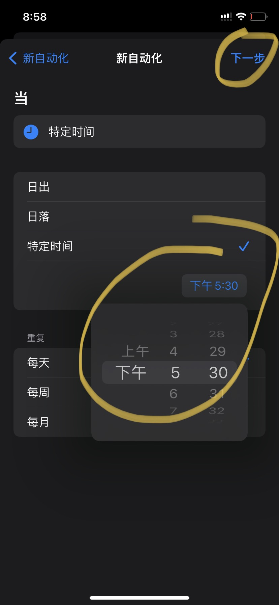

6. 选择Scriptable里面的buaaCheck脚本，将运行前询问去掉
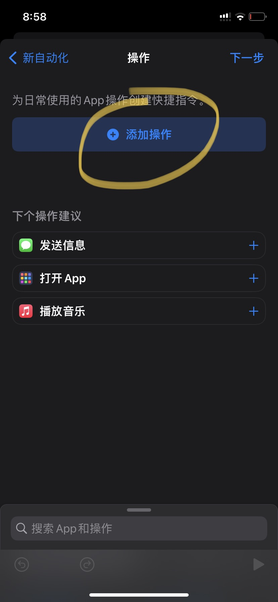
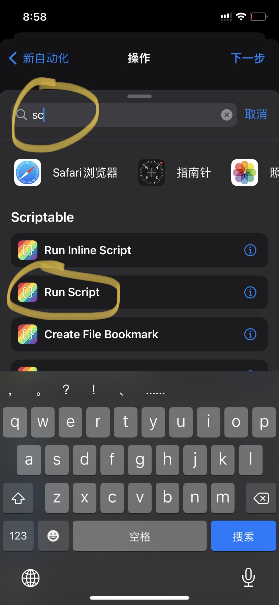
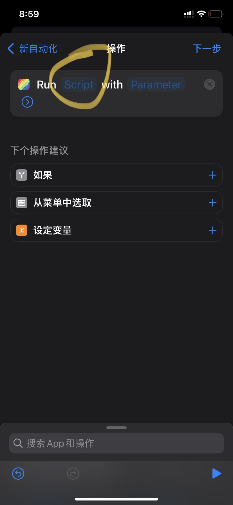
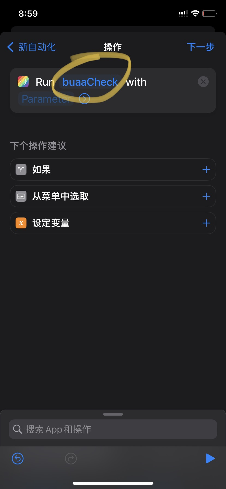
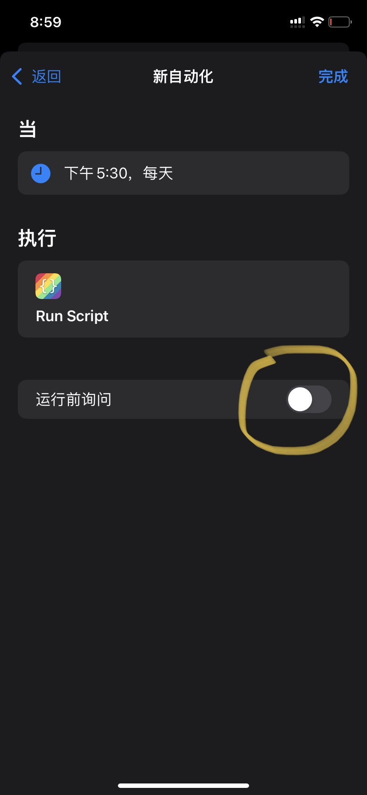
